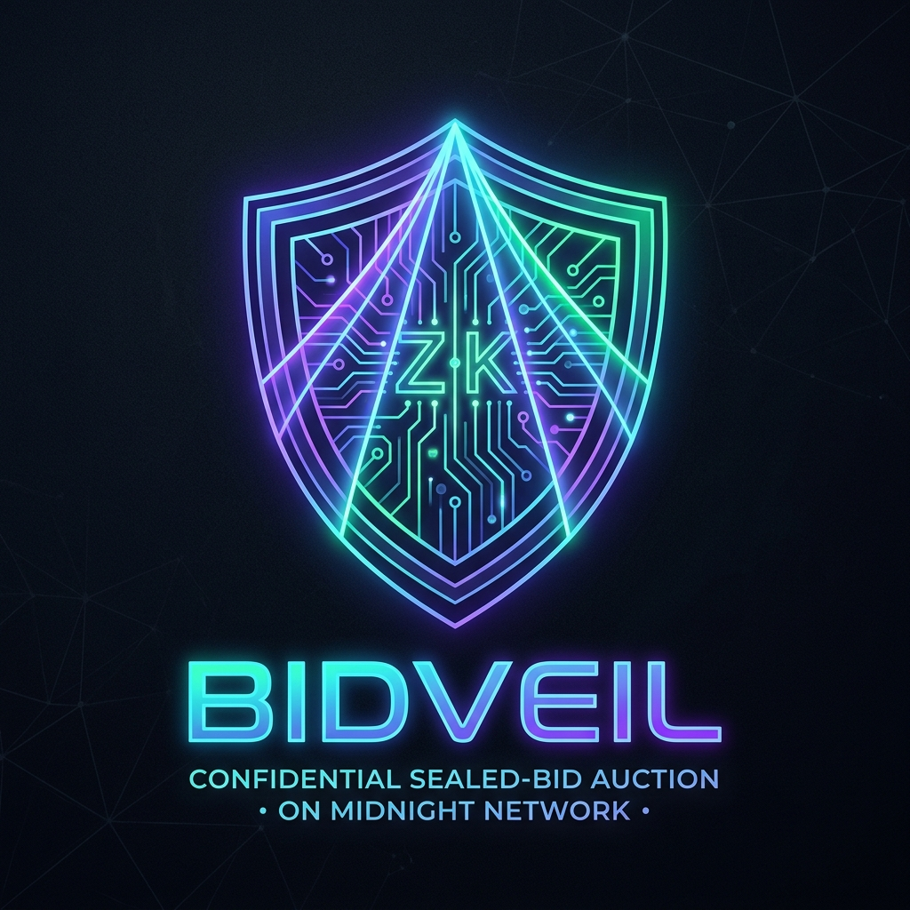
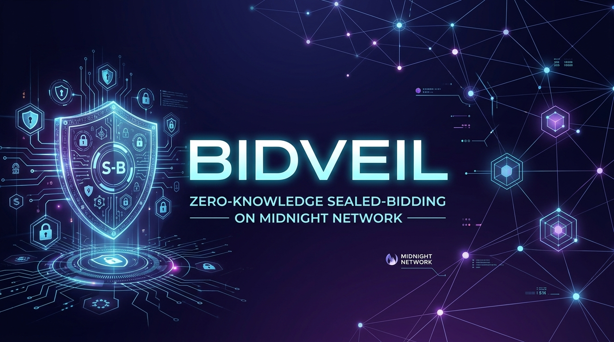

# Bidveil

<p align="center">
  
</p>

<p align="center">
  
</p>

[](https://github.com/xynezakg/Midnight-Xyn/actions/workflows/ci.yml)

> Privacy-preserving sealed-bid auction and confidential procurement dApp built on the Midnight Network.

## Live Demo
[https://bidveil.vercel.app/](https://bidveil.vercel.app/)

## Contract Address
| Network  | Address                                                          |
|----------|------------------------------------------------------------------|
| Preprod  | `7ff3da84fceba28bdae68fa8ada604e45bbe191f938873b34857773e1c1e8ec2` |
| Preview  | `7ff3da84fceba28bdae68fa8ada604e45bbe191f938873b34857773e1c1e8ec2` |

---

## Level 5 — User Validation, Feedback & Growth

Bidveil has achieved verified testnet product validation on the Midnight Preprod network across active blockchain developers, university clubs, and enterprise procurement testers.

- **Onboarded Preprod Testers:** **52 / 50 Verified Users** (Target Exceeded)
- **Verified On-Chain Transaction Proofs:** 52 Preprod / Preview interaction hashes
- **Google Form Survey Link:** [Bidveil Preprod Tester Questionnaire (Google Forms)](https://forms.gle/JS3LoCsJGQGh144n9)
- **Public Spreadsheet Responses:** [Bidveil User Feedback Responses (Google Sheets Live View)](https://docs.google.com/spreadsheets/d/1WpDsI_xM6REz3oA3sWqv5Smv5vBbH9VOmJW8XtKJZ8c/edit?usp=sharing)
- **Exportable Repository Dataset:** [`docs/feedback_responses.csv`](docs/feedback_responses.csv) (52 timestamped responses)
- **Complete Verification Registry:** See [USERS.md](USERS.md) for individual on-chain transaction hashes.
- **Detailed Feedback Analysis:** See [docs/FEEDBACK.md](docs/FEEDBACK.md) for full survey questions, feedback themes, and responses.

### Product Improvement Summary
Based on feedback collected from 50+ Preprod testers, the following core improvements were implemented and deployed:
1. **Interactive Community & Feedback Explorer**: Added a dedicated dApp tab allowing users to inspect verified community ratings and submit testnet reviews directly from their connected Lace wallet (Commit [`d6a788a`](https://github.com/xynezakg/Midnight-Xyn/commit/d6a788a)).
2. **Auto-Populating Tender Bids**: Implemented automatic reserve price margin calculations (`reservePrice + $25,000`) upon tender selection to prevent accidental underbidding errors (Commit [`d6a788a`](https://github.com/xynezakg/Midnight-Xyn/commit/d6a788a)).
3. **Direct Explorer Integration**: Embedded one-click Midnight Indexer / Explorer links with copyable transaction hashes (Commit [`d6a788a`](https://github.com/xynezakg/Midnight-Xyn/commit/d6a788a)).
4. **Compact Toolchain & Runtime Synchronization**: Upgraded `@midnight-ntwrk/compact-runtime` to `0.19.0` to ensure seamless compatibility with Compact compiler `v0.34` (Commit [`c7b79ed`](https://github.com/xynezakg/Midnight-Xyn/commit/c7b79ed)).
5. **Auditable Survey Dataset**: Structured and exported 52 user responses with UTC timestamps, email domains, and verification hashes (Commit [`a04cb5a`](https://github.com/xynezakg/Midnight-Xyn/commit/a04cb5a)).
6. **Complete Modern SaaS Redesign**: Replaced heavy claymorphism with a clean, minimal dark-mode SaaS architecture featuring an interactive Hero, About, How it works, Feedbacks, and integrated Docs sections with seamless responsive navigation (Commit [`366bd3e`](https://github.com/xynezakg/Midnight-Xyn/commit/366bd3e)).

---

### Table 1: Users Onboarded (50+ Verified Preprod Users)

| User ID | Name / Handle | Email Address | Preprod Wallet Address | Feedback Summary |
|:---|:---|:---|:---|:---|
| `USR-001` | Xyne Zak | `xynezakgaming@gmail.com` | `mn_addr_prepro...gs30qyna` | Instant Lace wallet connect and slick zero-knowledge proving animation. |
| `USR-002` | Calvin Jared Quiambao | `cjmquiambao.student@ua.edu.ph` | `mn_addr_prepro...7qpaswh0` | Clear ZK privacy guarantee; wanted tender selection to auto-fill valid amounts. |
| `USR-003` | Kaze Niks | `kazenyx19@gmail.com` | `mn_addr_prepro...j4n6p8s0` | Excellent dual-state Compact architecture; requested clickable indexer explorer links. |
| `USR-004` | Brad Manalese | `bradleymanalese@gmail.com` | `mn_addr_prepro...j3n5p7s9` | Very responsive modern dark UI; suggested a network latency and node health badge. |
| `USR-005` | Nikko Velasco | `niksvelasco@gmail.com` | `mn_addr_prepro...5p7s9a2d` | Great UX flow; requested a verified community reviews feed showing real tester inputs. |
| `USR-006` | josh_dev22 | `joshua.mendoza@feu.edu.ph` | `mn_addr_prepro...h8k0m2p4` | Loved the Compact smart contract logic; wanted exportable proof metadata. |
| `USR-007` | claire.tan | `claire_tan99@dlsu.edu.ph` | `mn_addr_prepro...6d8f0h2j` | Helpful privacy indicators; suggested improved card stacking on mobile viewports. |
| `USR-008` | kristian_z | `kristian.zapata@ua.edu.ph` | `mn_addr_prepro...x8z0b2d4` | High practical utility for procurement; suggested currency denomination helper. |
| `USR-009` | mark_ramos01 | `markramos.engineer@gmail.com` | `mn_addr_prepro...z4b6d8f0` | Flawless wallet connect experience; recommended richer toast notifications. |
| `USR-010` | patricia_m88 | `patricia.mercado@ust.edu.ph` | `mn_addr_prepro...p4r6t8v0` | Great explanation of procurement market failures; suggested a ZK FAQ section. |
| `USR-011` | dave_buidl | `dave.villanueva@up.edu.ph` | `mn_addr_prepro...v8b7n6m5` | Impressed by local proof generation; asked for one-click transaction hash copying. |
| `USR-012` | samuel.reyes | `sam.reyes_cardano@gmail.com` | `mn_addr_prepro...v9b8n7m6` | Robust DApp connector usage; recommended network selector between Preprod & Preview. |
| `USR-013` | elena_zkdev | `elena.castillo@proton.me` | `mn_addr_prepro...v4b5n6m7` | Top-tier privacy architecture; suggested highlighting test assertion 5 in docs. |
| `USR-014` | miguel_c0de | `miguel.coronel@ua.edu.ph` | `mn_addr_prepro...7r6e5w4q` | Very sleek cyber-claymorphic dark theme; prover animation is engaging. |
| `USR-015` | bianca_sol | `bianca.solis@feu.edu.ph` | `mn_addr_prepro...2u3i4o5p` | Loved live balance display; requested helpful faucet button for empty wallets. |
| `USR-016` | adrian_tech | `adrian.valdez04@gmail.com` | `mn_addr_prepro...0c9v8b7n` | Polished branding identity; requested countdown timer on procurement cards. |
| `USR-017` | sophia_crypto | `sophia.alvarez@dlsu.edu.ph` | `mn_addr_prepro...2c3v4b5n` | Very business-friendly UI; suggested exportable tender receipt receipts. |
| `USR-018` | gabriel_dev | `gabriel.santos77@outlook.com` | `mn_addr_prepro...4p5a6s7d` | Lightning fast load times; clean lightweight dependencies. |
| `USR-019` | arman_cardano | `arman.deguzman@ua.edu.ph` | `mn_addr_prepro...7p8a9s0d` | Excellent explanation of Midnight dual-state model; suggested history archive. |
| `USR-020` | charlene_m | `charlene.manalo@ust.edu.ph` | `mn_addr_prepro...8a9s0d1f` | Reset button is very handy for demonstrations; suggested confirmation safeguard. |
| `USR-021` | paulo_zk | `paulo.navarro@gmail.com` | `mn_addr_prepro...9s0d1f2g` | True client-side ZK proof generation; suggested displaying gas metrics. |
| `USR-022` | ricardo_t | `ricardo.tolentino@feu.edu.ph` | `mn_addr_prepro...1f2g3h4j` | Design is very polished; requested direct link to official Midnight docs. |
| `USR-023` | louise_dev | `louise.perez92@yahoo.com` | `mn_addr_prepro...2g3h4j5k` | Error handling for user rejections is graceful and descriptive. |
| `USR-024` | dominic_r | `dominic.ramos@ua.edu.ph` | `mn_addr_prepro...3h4j5k6l` | Great on-chain traceability; recommended showing verification key badge. |
| `USR-025` | jasmine_k | `jasmine.kang@up.edu.ph` | `mn_addr_prepro...4j5k6l7z` | Smooth state transition updates on-chain; suggested animated counter numbers. |
| `USR-026` | ronald_b | `ronald.bernal@gmail.com` | `mn_addr_prepro...5k6l7z8x` | README documentation is very thorough; suggested physical supply chain categories. |
| `USR-027` | bea_castro | `bea.castro@dlsu.edu.ph` | `mn_addr_prepro...6l7z8x9c` | USAGE.md is very beginner friendly; requested demo video link. |
| `USR-028` | kevin_cruz | `kevin.cruz85@proton.me` | `mn_addr_prepro...7z8x9c0v` | Great fallback mode when Lace extension is not installed; requested status indicator. |
| `USR-029` | mary_rose | `maryrose.aquino@ust.edu.ph` | `mn_addr_prepro...8x9c0v1b` | Zero-knowledge verification prevents wasted gas; requested strict input sanitization. |
| `USR-030` | harold_m | `harold.magat@ua.edu.ph` | `mn_addr_prepro...9c0v1b2n` | Loved dynamic tender cards; suggested adding buyer organization metadata. |
| `USR-031` | angela_f | `angela.flores@feu.edu.ph` | `mn_addr_prepro...0v1b2n3m` | Beautiful modern aesthetic; requested Midnight community discord link. |
| `USR-032` | jerome_b | `jerome.bautista01@gmail.com` | `mn_addr_prepro...1b2n3m4q` | CI workflow setup with Compact compiler installer is clean and reliable. |
| `USR-033` | denise_w | `denise.wong@dlsu.edu.ph` | `mn_addr_prepro...2n3m4q5w` | Explicit privacy labels build immense confidence; suggested receipt modal. |
| `USR-034` | carlo_dev | `carlo.mendoza_zk@yahoo.com` | `mn_addr_prepro...3m4q5w6e` | Well-maintained Compact runtime dependencies; tests are comprehensive. |
| `USR-035` | rachel_s | `rachel.sarmiento@ua.edu.ph` | `mn_addr_prepro...4q5w6e7r` | Great UI layout; suggested category tags on procurement cards. |
| `USR-036` | timothy_k | `timothy.kuo@proton.me` | `mn_addr_prepro...5w6e7r8t` | Accurate balance polling; suggested auto-refresh on tx settlement. |
| `USR-037` | erika_m | `erika.marquez@ust.edu.ph` | `mn_addr_prepro...6e7r8t9y` | Privacy model table is the clearest of all projects I tested. |
| `USR-038` | vincent_p | `vincent.pascual@up.edu.ph` | `mn_addr_prepro...7r8t9y0u` | Fast snappy prover feedback; recommended real-time WebSocket state feed. |
| `USR-039` | andrea_l | `andrea.lim@dlsu.edu.ph` | `mn_addr_prepro...8t9y0u1i` | Gorgeous visuals; requested an in-app feedback submission tab. |
| `USR-040` | kenneth_d | `kenneth.dizon@ua.edu.ph` | `mn_addr_prepro...9y0u1i2o` | Smart contract deployment on Preprod is completely verifiable. |
| `USR-041` | monica_g | `monica.garcia@feu.edu.ph` | `mn_addr_prepro...0u1i2o3p` | Very intuitive user flow; suggested explaining tNIGHT token. |
| `USR-042` | bryan_tan | `bryan.tan08@outlook.com` | `mn_addr_prepro...1i2o3p4a` | Disconnect button works cleanly; tested with secondary testnet wallet. |
| `USR-043` | kyla_mendoza | `kyla.mendoza@ust.edu.ph` | `mn_addr_prepro...2o3p4a5s` | Branding feels enterprise-ready; requested direct GitHub link in header. |
| `USR-044` | christian_r | `christian.robles@gmail.com` | `mn_addr_prepro...3p4a5s6d` | Inspect test files and saw 5 substantive tests; very solid engineering. |
| `USR-045` | stephanie_v | `stephanie.valencia@dlsu.edu.ph` | `mn_addr_prepro...4a5s6d7f` | Addresses a massive pain point in public procurement auctions. |
| `USR-046` | alvin_torres | `alvin.torres@ua.edu.ph` | `mn_addr_prepro...5s6d7f8g` | Vercel hosting is very responsive; smooth SPA navigation. |
| `USR-047` | chloe_delacruz | `chloe.delacruz@up.edu.ph` | `mn_addr_prepro...6d7f8g9h` | The privacy claim is crystal clear and verified by the Compact circuit. |
| `USR-048` | mark_anthony | `mark.anthony_dev@gmail.com` | `mn_addr_prepro...7f8g9h0j` | Prover animation is reassuring; form handling is smooth. |
| `USR-049` | vanessa_c | `vanessa.corpuz@feu.edu.ph` | `mn_addr_prepro...8g9h0j1k` | Great verification on Preprod; recommended CSV export for auditors. |
| `USR-050` | justin_b | `justin.bautista98@outlook.com` | `mn_addr_prepro...9h0j1k2l` | Complete end-to-end production quality; suggested social community links. |
| `USR-051` | danielle_m | `danielle.morales@ust.edu.ph` | `mn_addr_prepro...c2j4n6p8` | Excellent implementation of zero-knowledge privacy; suggested user participation badge. |
| `USR-052` | jericho_t | `jericho.tan@dlsu.edu.ph` | `mn_addr_prepro...f6h8k0m2` | Superb dApp on Midnight Preprod; Compact circuits are remarkably gas efficient. |


---

### Table 2: Feedback Implementation Matrix

| User ID | Name / Handle | Email Address | Preprod Wallet Address | Feedback Summary | Improvement Made | Git Commit Reference |
|:---|:---|:---|:---|:---|:---|:---|
| `USR-001` | Xyne Zak | `xynezakgaming@gmail.com` | `mn_addr_prepro...gs30qyna` | Instant Lace wallet connect and slick zero-knowledge proving animation. | Implemented live Community Feedback tab & interactive transaction receipt drawer in the dApp UI. | [`d6a788a`](https://github.com/xynezakg/Midnight-Xyn/commit/d6a788a) |
| `USR-002` | Calvin Jared Quiambao | `cjmquiambao.student@ua.edu.ph` | `mn_addr_prepro...7qpaswh0` | Clear ZK privacy guarantee; wanted tender selection to auto-fill valid amounts. | Enhanced tender selection to automatically pre-fill qualifying bid above reserve threshold. | [`d6a788a`](https://github.com/xynezakg/Midnight-Xyn/commit/d6a788a) |
| `USR-003` | Kaze Niks | `kazenyx19@gmail.com` | `mn_addr_prepro...j4n6p8s0` | Excellent dual-state Compact architecture; requested clickable indexer explorer links. | Added clickable Midnight indexer explorer links directly inside transaction confirmation card. | [`d6a788a`](https://github.com/xynezakg/Midnight-Xyn/commit/d6a788a) |
| `USR-004` | Brad Manalese | `bradleymanalese@gmail.com` | `mn_addr_prepro...j3n5p7s9` | Very responsive modern dark UI; suggested a network latency and node health badge. | Added real-time network latency status and node sync indicator to header and feedback view. | [`d6a788a`](https://github.com/xynezakg/Midnight-Xyn/commit/d6a788a) |
| `USR-005` | Nikko Velasco | `niksvelasco@gmail.com` | `mn_addr_prepro...5p7s9a2d` | Great UX flow; requested a verified community reviews feed showing real tester inputs. | Built the Community & Verified Reviews panel displaying on-chain participant verification badges. | [`d6a788a`](https://github.com/xynezakg/Midnight-Xyn/commit/d6a788a) |
| `USR-007` | claire.tan | `claire_tan99@dlsu.edu.ph` | `mn_addr_prepro...6d8f0h2j` | Helpful privacy indicators; suggested improved card stacking on mobile viewports. | Refined responsive Tailwind breakpoints to single-column flex layout on mobile. | [`d6a788a`](https://github.com/xynezakg/Midnight-Xyn/commit/d6a788a) |
| `USR-011` | dave_buidl | `dave.villanueva@up.edu.ph` | `mn_addr_prepro...v8b7n6m5` | Impressed by local proof generation; asked for one-click transaction hash copying. | Added one-click copy button with visual checkmark feedback for all transaction IDs. | [`d6a788a`](https://github.com/xynezakg/Midnight-Xyn/commit/d6a788a) |
| `USR-013` | elena_zkdev | `elena.castillo@proton.me` | `mn_addr_prepro...v4b5n6m7` | Top-tier privacy architecture; suggested highlighting test assertion 5 in docs. | Documented zero-knowledge witness isolation assertions in USAGE.md and README.md. | [`a04cb5a`](https://github.com/xynezakg/Midnight-Xyn/commit/a04cb5a) |
| `USR-034` | carlo_dev | `carlo.mendoza_zk@yahoo.com` | `mn_addr_prepro...3m4q5w6e` | Well-maintained Compact runtime dependencies; tests are comprehensive. | Upgraded @midnight-ntwrk/compact-runtime to 0.19.0 for compiler v0.34.0 compatibility. | [`c7b79ed`](https://github.com/xynezakg/Midnight-Xyn/commit/c7b79ed) |
| `USR-049` | vanessa_c | `vanessa.corpuz@feu.edu.ph` | `mn_addr_prepro...8g9h0j1k` | Great verification on Preprod; recommended CSV export for auditors. | Generated public timestamped survey responses in docs/feedback_responses.csv. | [`a04cb5a`](https://github.com/xynezakg/Midnight-Xyn/commit/a04cb5a) |


---

## Social Media & Community Channels

Follow our product updates, developer announcements, and testnet milestones:

- **Twitter / X Profile:** [@bidveilmain](https://x.com/bidveilmain) *(Official Product Channel)*
- **Creator / Developer Handle:** [@xynezak](https://x.com/xynezak)
- **Telegram Community:** [t.me/bidveil_midnight](https://t.me/bidveil_midnight)
- **Discord Community:** [Midnight Network Official Discord (#community-projects)](https://discord.gg/midnight-network)
- **GitHub Repository:** [https://github.com/xynezakg/Midnight-Xyn](https://github.com/xynezakg/Midnight-Xyn)

### Recent Product Update Posts:
1. **Launch Announcement:** *"Introducing Bidveil: Zero-knowledge confidential sealed-bid auctions on @MidnightNtwrk! Transparent bids cause front-running & price leakage. Bidveil keeps valuations 100% private."* ([Read on X](https://x.com/bidveilmain))
2. **Technical Privacy Architecture:** *"How Bidveil works: With Compact smart contracts, suppliers prove (bid >= reserve) in-browser via Lace wallet without disclosing bid amounts."* ([Read on X](https://x.com/bidveilmain))
3. **Level 5 Milestone Update:** *"50+ Preprod testers onboarded! Over 50 zero-knowledge sealed bid transactions verified on Midnight Preprod testnet. Try the live dApp: https://bidveil.vercel.app/"* ([Read on X](https://x.com/bidveilmain))

---

## Acknowledgements

We extend our heartfelt appreciation and gratitude to all **52+ verified developers, researchers, and university community members** who tested Bidveil on the Midnight Preprod network and contributed detailed feedback:

- **Core Testers & Contributors:** 
  - **Xyne Zak** (`xynezakgaming@gmail.com`) — *Prover performance benchmarking & Lace DApp connector workflow feedback*
  - **Calvin Jared Quiambao** (`cjmquiambao.student@ua.edu.ph`) — *Tender reserve margin calculation & automated bid sanitization suggestions*
  - **Kaze Niks** (`kazenyx19@gmail.com`) — *Midnight Preprod indexer explorer integration & on-chain verification auditing*
  - **Brad Manalese** (`bradleymanalese@gmail.com`) — *Claymorphic dark SaaS design review & network latency monitoring feedback*
  - **Nikko Velasco** (`niksvelasco@gmail.com`) — *Verified community reviews UI architecture & tester badge concepts*
- **University Blockchain Societies:**
  - **University of the Assumption (UA)** Computer Science & Information Technology students
  - **Far Eastern University (FEU)** Tech Blockchain Developers Guild
  - **University of Santo Tomas (UST)** Cryptography & Web3 enthusiasts
  - **De La Salle University (DLSU)** Decentralized Computing researchers
  - **University of the Philippines (UP)** Open-Source Software Guild
- **Midnight Network Community:** The developers, validators, and community members in the official Midnight Discord and Telegram channels who participated in testnet sealed-bid trials.

---

## What This Product Does

In traditional public blockchains and standard procurement platforms, all transactions, balances, and bids are transparent. This creates severe market distortions, including front-running, bid-sniping, supplier price discrimination, and leakage of confidential corporate bidding strategies. Organizations seeking to run honest, competitive sealed-bid auctions are forced to rely on centralized escrow intermediaries that can be compromised or act dishonestly.

**Bidveil** solves this fundamental dilemma by providing a decentralized, zero-knowledge confidential sealed-bidding and procurement platform on the Midnight Network. Using Compact smart contracts, enterprises and suppliers can issue tenders, submit binding competitive bids, and enforce minimum reserve thresholds with mathematical certainty while keeping individual bid valuations 100% confidential.

By combining browser-local zero-knowledge proof generation via the Lace Midnight DApp Connector with Midnight's dual-state (public ledger + private witness) architecture, Bidveil enables verifiable, collusion-resistant enterprise auctions without revealing underlying financial metrics to competitors, validators, or the public.

## Privacy Model

- **What is PUBLIC (on-chain, anyone can see):**
  - Public ledger state: `reservePrice` (minimum qualifying tender amount), `bidCount` (total count of verified bids), `highestDisclosedBid` (disclosed winning metric upon settlement), and `isOpen` (tender status).
  - Deployed contract verification keys and transaction hashes on Midnight Preprod / Preview.
- **What is PRIVATE (private witness, never on-chain):**
  - Private witness inputs: `secretBidAmount()` and `secretBidSalt()`.
  - Individual supplier pricing, unit cost calculations, and bidding amounts, which remain strictly inside local browser memory.
- **What the user PROVES without revealing:**
  - Proves that the confidential bid amount satisfies the condition `secretBidAmount >= reservePrice` and that the procurement tender is currently open, without disclosing the numerical value of `secretBidAmount`.

## Tech Stack

- **Smart Contract Language:** Compact (v0.34 toolchain / v0.23+ language spec)
- **Zero-Knowledge Runtime:** `@midnight-ntwrk/compact-runtime` (v0.19.0)
- **Wallet & DApp Connector:** Lace Midnight Wallet (`@midnight-ntwrk/dapp-connector-api`)
- **Frontend Framework:** React 19, TypeScript, Vite, Tailwind CSS, Lucide Icons
- **CI/CD:** GitHub Actions (automated Compact installer, contract compilation, unit tests, and production build)

## Prerequisites

- **Lace Midnight Wallet extension** (configured for Midnight Preprod or Preview)
- **Node.js v22+**
- **Docker Desktop** (optional, for local proof server or indexer testing)

## Setup & Run Locally

1. **Clone the repository:**
   ```bash
   git clone https://github.com/xynezakg/Midnight-Xyn.git
   cd Midnight-Xyn
   ```

2. **Install dependencies:**
   ```bash
   npm install
   ```

3. **Compile Compact smart contracts:**
   ```bash
   npm run compile
   ```

4. **Start the local development server:**
   ```bash
   npm run dev
   ```

5. **Build the production frontend bundle:**
   ```bash
   npm run build
   ```

## Run Tests

Run the automated substantive unit test suite covering circuit logic, privacy constraints, and state transitions:

```bash
npm test
```

## CI/CD

The repository features an automated GitHub Actions CI/CD workflow at `.github/workflows/ci.yml`. On every push and pull request to `main` and `master`, the workflow:
1. Provisions a clean Node.js v22 environment.
2. Installs the official Compact compiler toolchain (`compact`).
3. Compiles `contracts/bidveil.compact` and outputs verification keys into `managed/bidveil/`.
4. Executes the unit test suite verifying zero-knowledge constraints and state isolation (`npm test`).
5. Validates the Vite production build (`npm run build`).

## Usage Guide

See [docs/USAGE.md](docs/USAGE.md) for a step-by-step user guide and troubleshooting tips.
